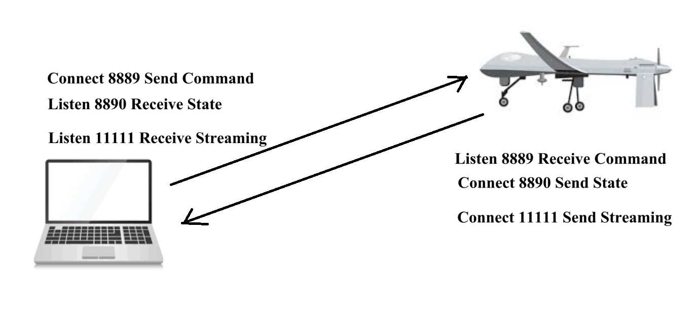
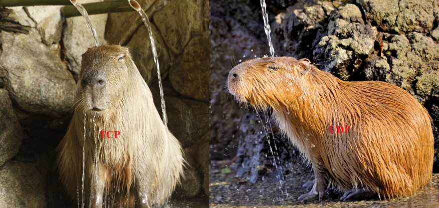
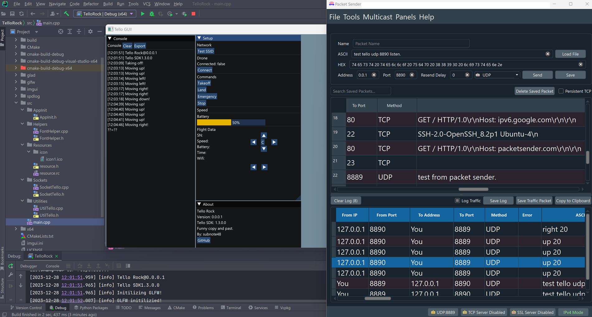

TelloRock

[C++] Example of a guideline for writing a drone control program.

Data transmission uses UDP, which has errors but reduces latency.

Must-have knowledge
1. C++14 Standard
2. The ImGui example uses opengl3. You can study it from the example.
   https://github.com/ocornut/imgui/tree/master/examples/example_glfw_opengl3

3. BoostAsio example is used
   https://github.com/boostorg/asio/tree/develop/example/cpp14/echo
   https://github.com/boostorg/asio/blob/develop/example/cpp14/echo/blocking_udp_echo_client.cpp
   https://github.com/boostorg/asio/blob/develop/example/cpp14/echo/blocking_udp_echo_server.cpp

4. Others such as Opengl, spdlog, glad, glfw

Download the Tello SDK directly from ryzerobotic.
https://dl-cdn.ryzerobotics.com/downloads/tello/20180910/Tello SDK Documentation EN_1.3.pdf

